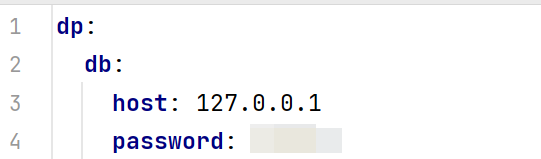
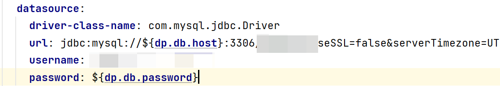
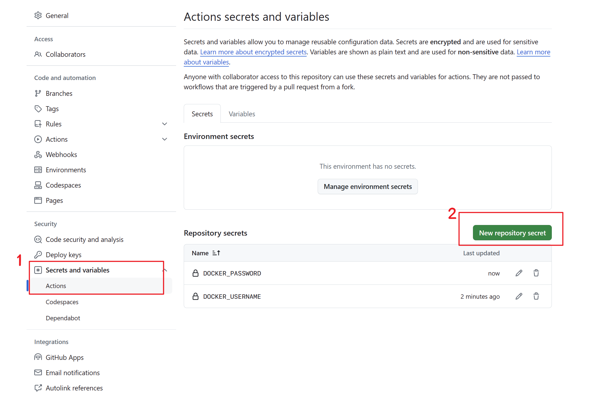
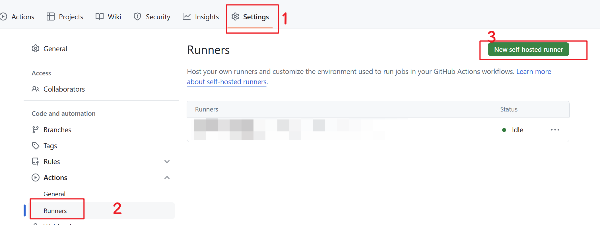
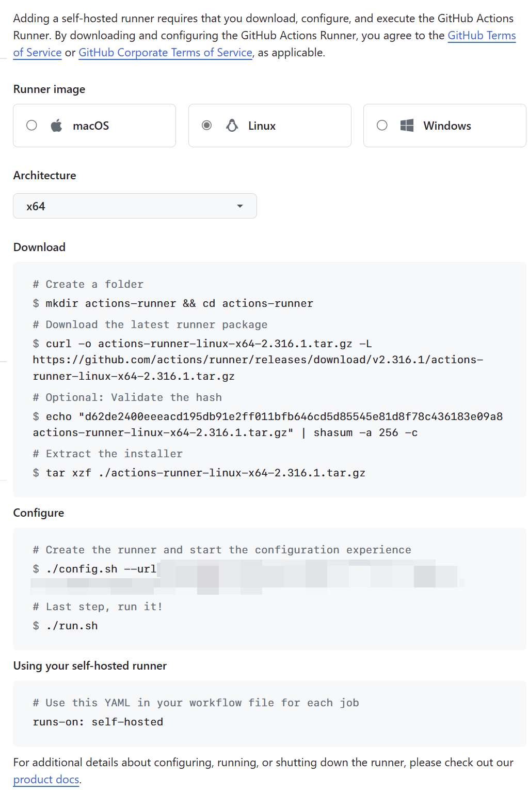

关于使用GitHub Actions 和 Docker部署SpringBoot后端项目。

<!--more-->

# GitHub Actions + Docker实现自动化部署

**可以先看一下这个教程**：[GitHub Actions工作流自动化的入门核心_哔哩哔哩_bilibili](https://www.bilibili.com/video/BV1aT421y7Ar/)

## SpringBoot多环境切换

> **参考**: [31 SpringBoot多环境的切换(生产环境、开发环境、测试环境)_spring boot生产和开发环境-CSDN博客](https://blog.csdn.net/qq_44885775/article/details/123471021)

Step 1: 在`resources/`下创建`application-dev.yaml`和`application-prouct.yaml`文件，分别表示开发环境和生产环境。

Step 2: 在两份配置文件中分别自定义配置，例如：



Step 3: 在`application.yaml`文件中引用：



Step 4: 激活配置文件：

- 配置文件：在配置文件中指定`spring.profiles.active=dev`
- 虚拟机参数：在VM options指定 `-Dspring.profiles.active=dev`
- 命令行参数：`java -jar xxx.jar –spring.profiles.active=dev`

IDEA中使用第二种即可，部署时使用命令行参数指定。

## Dockerfile文件编写

在项目根目录下，新建`Dockerfile`，内容如下：

```dockerfile
FROM fabric8/java-alpine-openjdk11-jre
ENV TZ=Asia/Shanghai
RUN rm -f /etc/localtime \
&& ln -sv /usr/share/zoneinfo/Asia/Shanghai /etc/localtime \
&& echo "Asia/Shanghai" > /etc/timezone
COPY target/*.jar /app.jar
ENTRYPOINT ["java","-jar","/app.jar", "--spring.profiles.active=product"]
```

**注意**：最后一行指定了配置文件。

## workflow文件编写

以下两种方式二选一即可。

### 使用GitHub提供的Ubuntu环境

在项目根目录下，新建`./github/workflows/delpoy.yml`文件，内容如下：

```yaml
# 使用Github Actions自动部署Spring Boot项目到服务器
name: Deploy With Docker
on:
  push:
    branches: [ master ]
jobs:
  build:
    name: Build工作
    runs-on: ubuntu-latest # 使用GitHub提供的Ubuntu环境
    steps:
      - name: 读取仓库内容
        uses: actions/checkout@v4

      - name: 设置Java环境
        uses: actions/setup-java@v4
        with:
          java-version: 11
          distribution: 'adopt'
          cache: 'maven'

      #      - name: 缓存Maven依赖
      #        uses: actions/cache@v3
      #        with:
      #          path: ~/.m2/repository
      #          key: ${{ runner.os }}-maven-${{ hashFiles('**/pom.xml') }}
      #          restore-keys: |
      #            ${{ runner.os }}-maven-

      - name: 编译打包
        run: mvn package -Dmaven.test.skip=true

      - name: 登录到DockerHub
        uses: docker/login-action@v3
        with:
          username: ${{ secrets.DOCKER_USERNAME }}
          password: ${{ secrets.DOCKER_PASSWORD }}

      - name: 构建Docker镜像
        uses: docker/build-push-action@v5
        with:
          context: .
          file: ./Dockerfile
          push: true
          tags: ${{ secrets.DOCKER_USERNAME }}/project-name:latest

      - name: 部署到服务器
        uses: appleboy/ssh-action@master
        with:
          host: ${{ secrets.SERVER_HOST }}
          username: ${{ secrets.SERVER_USERNAME }}
          port: ${{ secrets.SERVER_PORT }}
          password: ${{ secrets.SERVER_PASSWORD }}
          script: |
            sh /path/to/delpoy.sh
```

**project-name记得替换为自己的项目名称**

其中`deploy.sh`脚本内容如下（记得替换`{{}}`中内容，**端口记得按需修改**）：

```shell
docker pull {{username}}/{{project-name}}:latest
docker tag docker.io/{{username}}/{[project-name]}:latest {{project-name}}:latest
docker rm -f {{project-name}}
docker run --name {{project-name}} -p 1002:8081 -d {{project-name}}:latest
docker image prune -af
```

DockerHub记得先注册账号。如果Dockerhub上传的是私密镜像，记得在服务器登录账号：`docker login`

在GitHub项目设置中添加yml文件中的secrets，位置如下：



### 使用自己的服务器

Step 1: 添加Runner



Step 2: 选择服务器对应系统，按照所示步骤在服务器上执行即可：



> 其中，运行`config.sh`脚本记得使用非root用户，否则会报错。
>
> 其次`./run.sh`命令改为`nohup ./run.sh &`在后台不挂断运行。
>

Step 3: 在服务器记得安装maven和Java

```shell
sudo apt update
sudo apt install maven
mvn --version # 验证是否安装成功
```

> **参考**：[如何在 Ubuntu 20.04 上安装 Apache Maven-腾讯云开发者社区-腾讯云](https://cloud.tencent.com/developer/article/1649751)

Step 4: 在项目创建workflow文件，内容如下：

```yaml
name: Deploy With Runner
on:
  push:
    branches: [ master ]
jobs:
  build:
    name: Build工作
    runs-on: self-hosted # 使用自己的服务器
    steps:
      - name: 读取仓库内容
        uses: actions/checkout@v4

      - name: 设置Java环境
        run: |
          pwd
          java --version
          mvn --version

      - name: 编译打包
        run: mvn package -Dmaven.test.skip=true

      - name: 构建Docker镜像
        run: |
          docker build -f Dockerfile -t {{project-name}}:latest .

      - name: 部署到服务器
        run: |
          docker rm -f {{project-name}
          docker run -d --name {{project-name}} -p 1002:8080 {{project-name}}:latest
          docker ps
```

**端口记得按需修改**

## 开始自动化部署

将代码提交到GitHub后，在GitHub的Actions就能发现正在自动化部署。

## 参考

- [使用Github Actions + Docker 部署Spring Boot应用 - 掘金](https://juejin.cn/post/7011669659032387591#heading-1)
- [Github Actions实现Spring Boot自动化部署（第二弹）_JavaGPT的技术博客_51CTO博客](https://blog.51cto.com/u_14725510/7969896)

