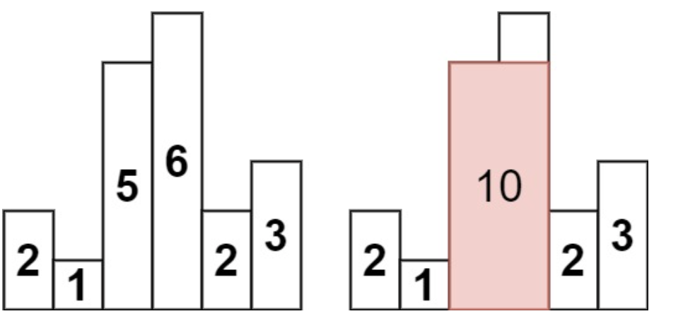
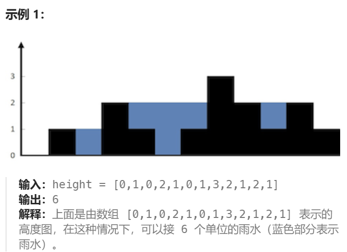
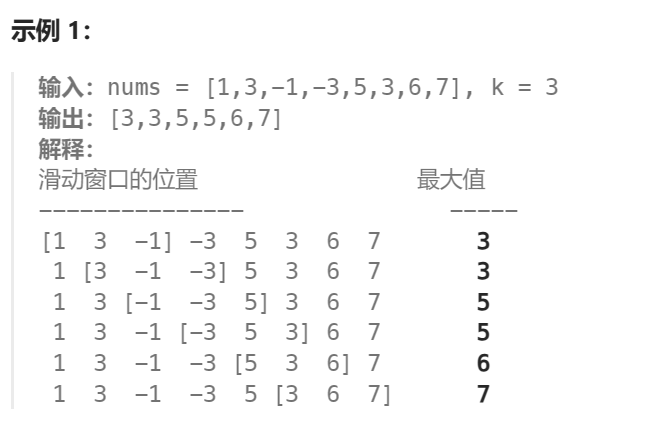

栈是一种「先进后出」的数据结构。**单调栈**是一种特殊的栈，在满足「先进后出」规则基础上，同时满足「从栈底到栈顶的元素单调递增/减」，因此也分为单调递增栈，单调递减栈。

单调栈用来解决**下一个更大/小元素**、**上一个更大/小元素**这一类的典型问题。比如[739. 每日温度](https://leetcode.cn/problems/daily-temperatures/description/?envType=study-plan-v2&envId=top-100-liked)，[84. 柱状图中最大的矩形](https://leetcode.cn/problems/largest-rectangle-in-histogram/?envType=study-plan-v2&envId=top-100-liked)，[42. 接雨水](https://leetcode.cn/problems/trapping-rain-water/description/?envType=study-plan-v2&envId=top-100-liked)都是这类问题。

队列是一种「先进先出」的数据结构。**单调队列**是一种特殊的队列，在满足「先进先出」规则基础上，同时满足「从队首到队尾的元素单调递增/减」。

单调队列用来解决**滑动窗口内的最大/小值**、**中位数的动态查询**这一类问题。比如[239. 滑动窗口最大值](https://leetcode.cn/problems/sliding-window-maximum/description/?envType=study-plan-v2&envId=top-100-liked)。

<!-- more -->

# 单调栈

这里以单调递减栈为例，可以解决求下一个更大元素问题。

单调递减栈的思想是：只有比栈顶元素小的元素才能直接进栈，否则需要将栈中更小的元素出栈。这样，当元素出栈时，就找到了下一个更大元素。

## 739. 每日温度 - 中等

[739. 每日温度](https://leetcode.cn/problems/daily-temperatures/description/?envType=study-plan-v2&envId=top-100-liked)：给定一个表示每日温度的整数数组，求对于每天在第几天后温度会比这天更高，如果没有，填0。

> 输入: temperatures = [73,74,75,71,69,72,76,73]
>
> 输出: [1,1,4,2,1,1,0,0]

思路：求的是下一个更大元素的索引距离，用单调递减栈，栈中记录的实际上是还没算出「下一个更大元素」的数字下标。

时间复杂度：O(n)，每个元素只进出栈一次。

```java
class Solution {
    public int[] dailyTemperatures(int[] temperatures) {
        int length=temperatures.length;
        int[] res=new int[length];
        Deque<Integer> stack=new ArrayDeque<>(); // 单调栈
        for(int i=0;i<length;i++){
            while(!stack.isEmpty()&&temperatures[i]>temperatures[stack.peekLast()]){
                int j=stack.pollLast();
                res[j]=i-j;
            }
            stack.offerLast(i);
        }
        // while(!stack.isEmpty()){
        //     res[stack.pollLast()]=0;
        // }
        return res;
    }
}
```

## 84. 柱状图中最大的矩形 - 困难

[84. 柱状图中最大的矩形](https://leetcode.cn/problems/largest-rectangle-in-histogram/description/?envType=study-plan-v2&envId=top-100-liked)：给定柱状图中每个柱子高度，求能勾勒出的矩形最大面积。



> 输入：heights = [2,1,5,6,2,3]
>
> 输出：10
>
> 解释：最大的矩形为图中红色区域，面积为 10

思路1：想要以某个柱子为高，那么必须知道这个柱子左右侧更矮柱子的下标，即要求更小元素下标。因此用2个单调递增栈，分别求上/下一个更小元素并保存，最后在遍历求面积即可。

思路2：计算右侧更矮柱子的下标时，单调栈用于维护没有找到右侧更矮柱子的柱子索引，当某个元素出栈时，说明这个元素找到右侧更矮柱子，同时新的栈顶元素（如果存在）一定是当前出栈柱子左侧更矮的柱子。（因为如果左侧有更高的柱子，都已经出栈，而更矮的柱子会留在里面）

```java
class Solution {
    public int largestRectangleArea(int[] heights) {
        Deque<Integer> stack=new ArrayDeque<>();
        int res=0;
        for(int i=0;i<heights.length;i++){
            while(!stack.isEmpty()&&heights[i]<heights[stack.peekLast()]){
                int curHeight=heights[stack.pollLast()];
                int leftIdx=0;
                if(!stack.isEmpty()){
                    leftIdx=stack.peekLast()+1;
                }
                int area=curHeight*(i-leftIdx);
                res=Math.max(res,area);
            }
            stack.offerLast(i);
        }
        while(!stack.isEmpty()){
            int curHeight=heights[stack.pollLast()];
            int leftIdx=0;
            if(!stack.isEmpty()){
                leftIdx=stack.peekLast()+1;
            }
            int area=curHeight*(heights.length-leftIdx);
            res=Math.max(res,area);
        }
        return res;
    }
}
```

## 42. 接雨水 - 困难

### 单调栈做法

[42. 接雨水](https://leetcode.cn/problems/trapping-rain-water/description/?envType=study-plan-v2&envId=top-100-liked)



思路：当我们找到右侧第一个比某个位置大的元素时，这里就能接水，相当于横着计算。


```java
class Solution {
    public int trap(int[] height) {
        // 单调栈做法
        Deque<Integer> stack=new ArrayDeque<>();
        int res=0;
        for(int i=0;i<height.length;i++){
            while(!stack.isEmpty()&&height[stack.peekLast()]<=height[i]){
                int curHeight=height[stack.pollLast()];
                if(stack.isEmpty()) break;
                int left=stack.peekLast();
                int h=Math.min(height[left], height[i])-curHeight;
                res+=h*(i-left-1);
            }
            stack.offerLast(i);
        }
        return res;
    }
}
```

### 双指针做法

思路：

- 某个位置能接的水=min(左边柱子的最高高度，记录右边柱子的最高高度) - 当前柱子高度。
- 使用相向双指针遍历分别记录左右两侧当前最大值，其中较小的那个就是公式用到的那个。

时间复杂度：O(n)，空间复杂度：O(1)。

```java
class Solution {
    public int trap(int[] height){
        // 双指针做法: min{lMax, rMax}-h[i], lMax=max{0,...,i}
        int res=0;
        int left=0, right=height.length-1;
        int lMax=height[0], rMax=height[right];
        while(left<=right){
            if(lMax<rMax){
                lMax=Math.max(lMax, height[left]);
                res+=lMax-height[left++];
            }else{
                rMax=Math.max(rMax, height[right]);
                res+=rMax-height[right--];
            }
        }
        return res;
    }
}
```

# 单调队列

单调队列的思想是：只有当一个元素是最值或者可能成为最值时才保留，否则出队。这样，每次移动窗口时，队首就是当前窗口最值。

## 239. 滑动窗口最大值 - 困难

[239. 滑动窗口最大值](https://leetcode.cn/problems/sliding-window-maximum/description/?envType=study-plan-v2&envId=top-100-liked)



思路：对于窗口[1 3 -1]，其中3是最大值，3之前的数字1比3小且更早离开，所以无论窗口如何移动都不会成为最大值，3之后的数字-1比3小但更晚离开，因此可能成为最大值。每次移动时，需要判断队首的最值是否离开窗口，判断队内的旧数字是否还可能成为新的最值，如果比新数字小就不可能，需要出队；否则可能，保留，然后再将新数字入队。

```java
class Solution {
    public int[] maxSlidingWindow(int[] nums, int k) {
        Deque<Integer> queue=new ArrayDeque<>();
        int[] res=new int[nums.length-k+1];
        // i指向即将入栈的元素，j指向即将出栈的元素
        for(int i=0, j=-k+1;i<nums.length;i++,j++){
            // 加入新元素，让窗口大小保持为k
            while(!queue.isEmpty()&&queue.peekLast()<nums[i]){
                queue.pollLast();
            }
            queue.offerLast(nums[i]); // 入队
            if(j<0) continue;
            // 计算当前窗口最值
            res[j]=queue.peekFirst();
            // 移动窗口
            if(queue.peekFirst()==nums[j]){
                queue.pollFirst();
            }
        }
        return res;
    }
}
```

# 栈：394. 字符串解码

[394. 字符串解码](https://leetcode.cn/problems/decode-string/description/?envType=study-plan-v2&envId=top-100-liked)

```java
class Solution {
    public String decodeString(String s) {
        StringBuilder res=new StringBuilder();
        int times = 0;
        LinkedList<Integer> timesStack=new LinkedList<>();
        LinkedList<String> substrStack=new LinkedList<>();
        for(int i=0;i<s.length();i++){
            char c=s.charAt(i);
            if(c>='0'&&c<='9'){
                times=times*10+Integer.parseInt(c+"");
            }else if(c == '['){
                timesStack.add(times);
                substrStack.add(res.toString());
                times=0;
                res=new StringBuilder();
            }else if(c==']'){
                int curTimes=timesStack.pollLast();
                StringBuilder str=new StringBuilder();
                while(curTimes--!=0) str.append(res);
                res=new StringBuilder(substrStack.pollLast()+str);
            }else{
                res.append(c);
            }
        }
        return res.toString();
    }
}
```

